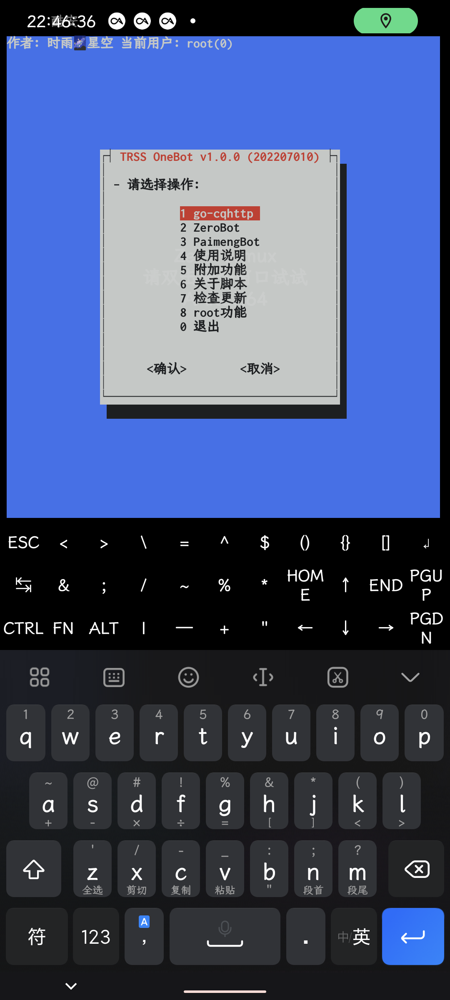
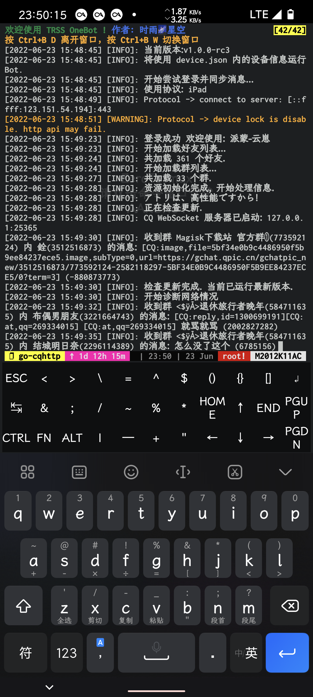
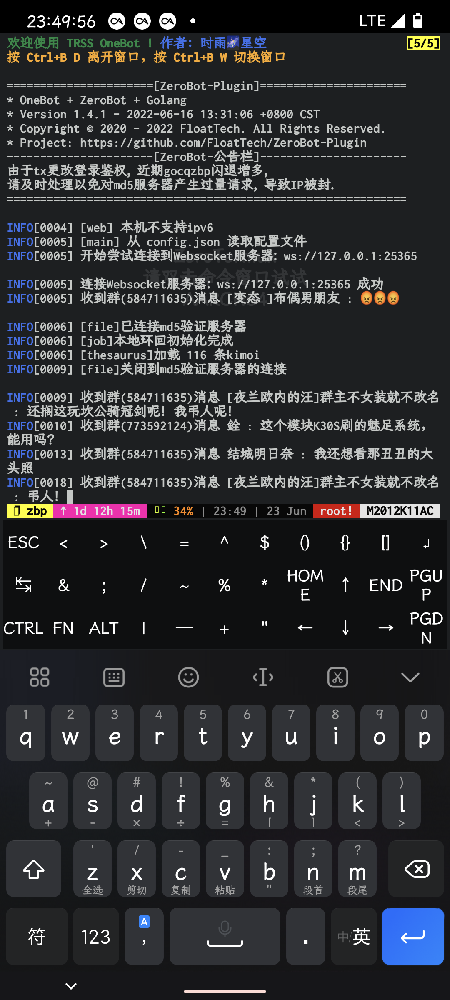
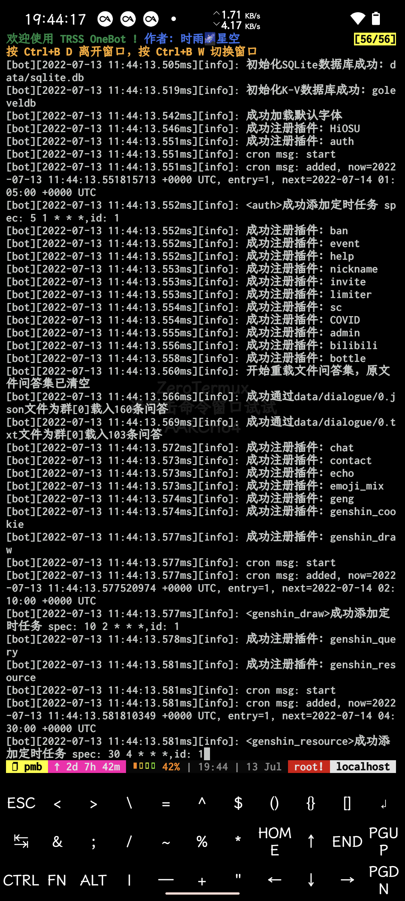

<div align="center">

[](https://moegirl.org.cn/亚托莉)

# TRSS OneBot
ZeroBot机器人管理脚本

[](../../stargazers)
[](Install.sh)
[](../../releases/latest)

[](https://github.com/TimeRainStarSky/TRSS_OneBot)

</div>

## 使用教程
1. 准备：[Linux](https://kernel.org) 或 [Termux](https://github.com/termux/termux-app)
- [Termux arm64](https://github.com/termux/termux-app) 专用版本见 [main 分支](../../tree/main)

2. 安装：
```
bash <(curl -L https://gitee.com/TimeRainStarSky/TRSS_OneBot/raw/linux/Install.sh)
```

3. 启动：`tsob`

视频教程：<https://b23.tv/av983453309>

## 使用说明
- [ZeroBot](https://github.com/wdvxdr1123/ZeroBot) <-WS连接-> [go-cqhttp](https://docs.go-cqhttp.org) <-网络连接-> [QQ服务器](https://im.qq.com)
- [go-cqhttp](https://docs.go-cqhttp.org)：提供QQ账号管理，收发消息等功能
- [ZeroBot](https://github.com/wdvxdr1123/ZeroBot)：对消息进行处理，完成目标操作
- Dialog 对话框：支持 触屏 / 鼠标 操作的交互式对话框
- [Tmux 终端复用器](https://github.com/tmux/tmux)：支持 触屏 / 鼠标 操作的交互式终端会话
- [Micro 文本编辑器](https://micro-editor.github.io)：支持 触屏 / 鼠标 操作的终端文本编辑器
- [Ranger 文件管理器](https://ranger.github.io)：支持 触屏 / 鼠标 操作的终端文件管理器
- 滚动更新：实时更新到最新版本，修复已知问题并添加更多功能
- 更多功能等待你来提出……

## 常见问题
- 问：发消息错误：46
- 答：账号被风控

- 问：无法连接到 WebSocket 服务器
- 答：请确认 go-cqhttp 正常运行并启动了 CQ WebSocket 服务器

- 问：address already in use
- 答：WebSocket 端口被占用，请尝试停止占用进程、重启设备，或修改配置文件，更改 WebSocket 端口

- 问：[server exited unexpectedly]
- 答：tmux 进程意外退出，可能是系统资源不足引起的，如果在 Termux 中经常出现，请检查设置：电池优化、后台运行权限

- 问：我有其他问题
- 答：提供详细问题描述，通过下方 联系方式 反馈问题

## 联系方式
- QQ群组：[211414032](https://jq.qq.com/?k=QU1xGLEB)
### 时雨🌌星空
- GitHub：[TimeRainStarSky](https://github.com/TimeRainStarSky)
- 酷安：[时雨丶星空](http://www.coolapk.com/u/2650948)
- QQ：[2536554304](https://qm.qq.com/cgi-bin/qm/qr?k=x8LtlP8vwZs7qLwmsbCsyLoAHy7Et1Pj)
- Telegram：[TimeRainStarSky](https://t.me/TimeRainStarSky)

## 赞助支持
- 爱发电：<https://afdian.net/a/TimeRainStarSky>
- Partme：<https://partme.com/TimeRainStarSky>

## 界面展示
[](https://github.com/TimeRainStarSky/TRSS_OneBot)
[](https://docs.go-cqhttp.org)
[](https://github.com/FloatTech/ZeroBot-Plugin)
[](https://richeyjang.github.io/PaimengBot)

## 相关项目
[](../../../TRSS_Liteyuki)
[](../../../TRSS_Yunzai)
[](../../../TRSS_Sagiri)
[](../../../TRSS_OneBot)